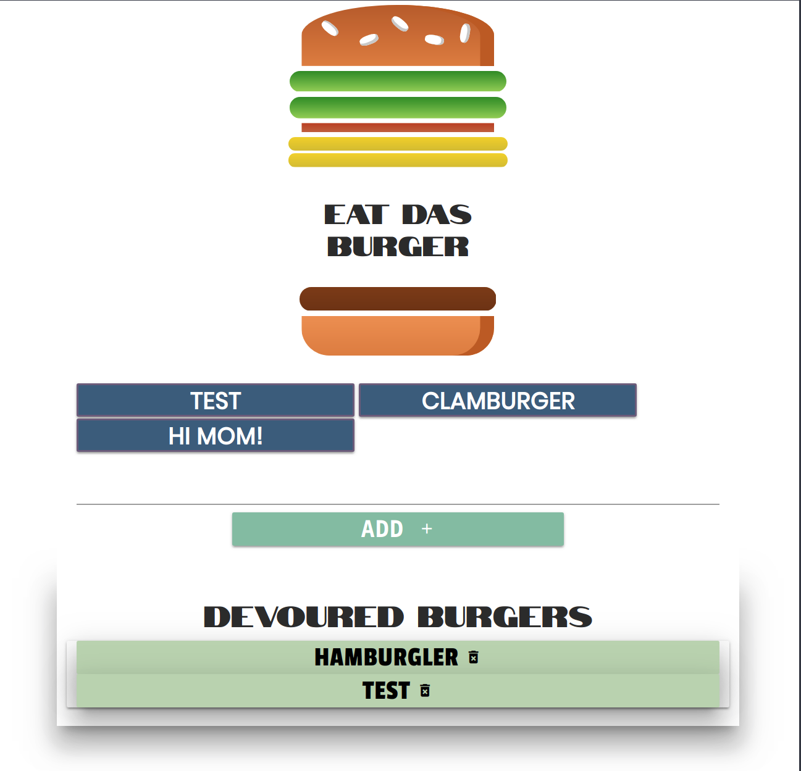

# EAT DAS BURGER

### Live version on heroku!

## Description

Eat Da Burger is a simple web application that allows a user to "eat da burger". There are two sections one of burgers that are not devoured (Not eaten) & one for burgers that have been devoured (eaten), when the user clicks on a burger that has not been devoured it is sent to the devoured section. If the user wants to add a burger of their own, there is a text box where the user can add any burger they'd like. As well if the use has devoured a burger and thinks its yucky! they can click the burger in the devoured section to remove it FOREVER. 

# Tech used
* Node.js
* Mysql database
* Javascript
* jQuery
* Materialize (HTML)
* CSS
## NPM Packages
* Express
* Body-parser
* Mysql
* Express-handlebars

# How to use
* Prereqs -> node.js & npm
* clone the repo to your local machine and enter directory in CLI
* (OPTIONAL) If using vagrant VM
    initalize the vagrantfile by running `vagrant up`
    When ready run `vagrant ssh`
    navigate to /var/www
* Then ->
* run `npm install` to get dependancies
* run the neccisary database files (schema / seeds)
* then run `node server.js`
* open your browser and go to localhost:3000 or 192.168.15.10:3000 (if using vagrant)

## Developed By Jake Plaisted
